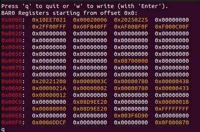

# RW_for_linux
I need a user-friendly UI to read / write PCIe BAR.
e.g. 

## Usage

>- Read
>1. Execute `sudo python3 ./RW.py`.
>2. Select a **device**.
>3. Select a **BAR**.
>4. Enter a **offset value**.

>- Write
>1. Press `w` and then `enter`.
>2. Enter a **offset value**.
>3. Enter a **vlaue**.